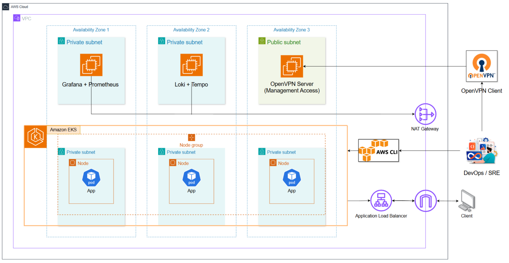

# Cloud-Native Infrastructure for Kubernetes

This repository contains the **Infrastructure as Code (IaC)** implementation for deploying a **k0s Kubernetes cluster on AWS**, focusing on a **staging environment** designed according to cloud-native and DevOps best practices.

The infrastructure provisioning is handled using **Terraform**, while **Ansible** is used for system configuration and observability deployment.

---

## 1. Overview

The objective of this project is to design and deploy a **cloud-native infrastructure** capable of running a k0s-based Kubernetes cluster in a manner that closely resembles real-world production environments.


## 2. Infrastructure Deployment and Configuration

The infrastructure is deployed using Terraform with a **module-based architecture**. Each module is responsible for a specific layer of the infrastructure, including networking, security, and compute resources.

Terraform is also responsible for generating dynamic Ansible inventory files, which enables seamless integration between infrastructure provisioning and system configuration.

### Usage

Clone the repository along with its submodules:

```bash
git clone --recurse-submodules https://github.com/tienphatng237/cloud-native-k8s-infrastructure.git
```

Navigate to the Terraform Hub and select the target environment:

```bash
cd cloud-native-k8s-infrastructure/terraform-hub/environments/<environment>
```

Initialize and validate the Terraform configuration:

```bash
terraform init
terraform validate
```

Review the execution plan:

```bash
terraform plan
```

Provision the infrastructure:

```bash
terraform apply
```

After the apply step completes, Terraform outputs will expose infrastructure metadata that can be consumed by Ansible for subsequent configuration and Kubernetes bootstrapping steps.

---

### 2.1 Staging Environment

The **staging environment** serves as a controlled platform for deploying,
testing, and validating a k0s Kubernetes cluster before any future
production-oriented extensions.


#### Staging Environment Characteristics

- Deployment across multiple Availability Zones to simulate real-world conditions
- A dedicated VPC with isolated private and public subnets
- k0s Kubernetes cluster consisting of:
  - One controller node
  - Multiple worker nodes
- Dedicated observability nodes running outside the Kubernetes cluster
- Secure management access via an OpenVPN server
- Outbound internet access for private instances through a NAT Gateway
- Load balancing capabilities for Kubernetes services using MetalLB and NGINX

Terraform automatically generates Ansible inventory files and places them under:

```
ansible/inventories/staging/
```

This approach ensures infrastructure consistency and eliminates the need for
hardcoded IP addresses during configuration.

#### Infrastructure Configuration

As part of the staging environment setup, secure access to private
infrastructure components is established before deploying Kubernetes
and observability services.

<details>
<summary><strong>Click here to view full infrastructure configuration steps (OpenVPN, k0s, MetalLB)</strong></summary>

<br/>

##### 1️⃣ OpenVPN Deployment (Secure Access to Private Subnets)

To securely manage EC2 instances located in private subnets, an OpenVPN
server is deployed as a controlled administrative access gateway.
This design eliminates the need to expose internal resources to the
public internet and closely aligns with real-world production security
best practices.

The OpenVPN server is provisioned and configured using **Ansible** to
ensure repeatability and consistency across environments.

---

**Connectivity Test**

Before deploying OpenVPN, verify SSH connectivity to the OpenVPN instance:

```bash
ansible -i inventories/staging/openvpn.ini openvpn -m ping
```

If the connectivity test succeeds, deploy the OpenVPN server using:

```bash
ansible-playbook -i inventories/staging/openvpn.ini playbooks/openvpn_setup.yml
```

After the playbook completes, the OpenVPN client configuration file
(`devops.ovpn`) is automatically generated on the server and fetched to
the local management machine.

---

**OpenVPN Client Configuration**

###### 🪟 Windows Clients

Copy the generated OpenVPN client configuration file to the OpenVPN
configuration directory on Windows:

```bash
cp vpn/devops.ovpn /mnt/c/Users/<username>/OpenVPN/config/
```

**Example:**

```bash
cp vpn/devops.ovpn /mnt/c/Users/phat4/OpenVPN/config/
```

After copying the file, open **OpenVPN Connect** and establish the VPN
connection using the imported configuration.

---

###### 🐧 Linux / WSL Clients (Recommended for DevOps Automation)

For Linux or WSL-based environments (used for Ansible, Terraform, and
kubectl operations), run OpenVPN directly inside the system.

Install OpenVPN if it is not already available:

```bash
sudo apt update
sudo apt install -y openvpn
```

Connect to the VPN using the generated configuration file:

```bash
sudo openvpn --config ~/devops.ovpn
```

Once the VPN connection is established, the system will receive routes
to the private VPC subnets, enabling direct access to internal EC2
instances.

---

**Accessing Private EC2 Instances**

After connecting to the VPN, administrators can securely access EC2
instances in private subnets via SSH:

```bash
ssh -i key_pair/k0s_key ubuntu@10.0.1.167
```

This access method ensures that all administrative traffic flows through the VPN tunnel, maintaining strict network isolation and minimizing the attack surface of the infrastructure.

##### 2️⃣ k0s Kubernetes Cluster Deployment (Controller & Workers)

After secure access to the private subnets has been established via OpenVPN,
the k0s Kubernetes cluster is deployed using Ansible.

The cluster is composed of:
- One k0s controller node responsible for control plane operations
- Multiple k0s worker nodes responsible for running application workloads

The deployment process is fully automated using a dedicated Ansible playbook,
ensuring consistency and repeatability across environments.

**Cluster deployment command:**

```bash
ansible-playbook -i inventories/staging/kubernetes.ini playbooks/k0s_setup.yml
```
This playbook performs the following actions:

- Installs k0s binaries on controller and worker nodes

- Initializes the k0s control plane on the controller node

- Joins worker nodes to the cluster using a secure token-based mechanism

- Configures kubeconfig access for cluster administration

*Cluster verification*

After the deployment completes, connect to the controller node via SSH:
```bash
ssh -i key_pair/k0s_key ubuntu@<controller-private-ip>
```

Verify that all nodes have successfully joined the cluster by executing:

```bash 
k0s kubectl get nodes
```
Example output: 


At this stage, all worker nodes should appear in the cluster and reach the
Ready state once networking components are fully initialized. This confirms
that the k0s cluster has been successfully deployed and is ready for
subsequent configuration steps such as load balancing and observability.

##### 3️⃣ Argo CD Deployment (GitOps)

Argo CD is deployed to enable **GitOps-based application delivery** for the staging k0s Kubernetes cluster.

Argo CD is installed as a **platform component** using Ansible and runs inside the Kubernetes cluster.

---

**Install Argo CD**

Argo CD is deployed on the k0s controller using the following playbook:

```
ansible-playbook \
  -i inventories/staging/kubernetes.ini \
  playbooks/argocd_setup.yml
```

This playbook:
- Creates the `argocd` namespace
- Installs Argo CD core components
- Waits until the Argo CD server is ready

---

**Verify Argo CD Components**

Verify that all Argo CD pods are running:

```
sudo k0s kubectl get pods -n argocd
```

Expected components:
- argocd-server
- argocd-repo-server
- argocd-application-controller
- argocd-dex-server
- argocd-redis
- argocd-notifications-controller

---

**Access Argo CD Dashboard**

For the staging environment, the Argo CD UI is accessed via SSH port forwarding.

Establish SSH port forwarding to the k0s controller:

```
ssh -i key_pair/k0s_key \
  -L 8080:localhost:8080 \
  ubuntu@<controller-private-ip>
```

On the controller node, forward the Argo CD service port:

```
sudo k0s kubectl port-forward \
  svc/argocd-server -n argocd 8080:443
```

Access the dashboard from the local machine:

```
https://localhost:8080
```

---

**Login**

Retrieve the initial admin password:

```
sudo k0s kubectl get secret argocd-initial-admin-secret \
  -n argocd \
  -o jsonpath="{.data.password}" | base64 -d
```

Login credentials:
- Username: `admin`
- Password: (output of the command above)

<!-- ##### 3️⃣ MetalLB Deployment (LoadBalancer Support for k0s)

In a self-managed Kubernetes environment such as k0s running on EC2,
cloud-native LoadBalancer services are not available by default.
To enable service exposure in a production-like manner, MetalLB is deployed
as the load-balancing solution for the staging cluster.

MetalLB is configured in **Layer 2 (L2) mode**, which is suitable for
staging and on-premise–like environments and integrates well with
private subnets in AWS.

The deployment is fully automated using Ansible.

**MetalLB deployment command:**

```bash
ansible-playbook \
  -i inventories/staging/kubernetes.ini \
  playbooks/metallb_setup.yml
```

This playbook performs the following actions:

- Installs MetalLB Custom Resource Definitions (CRDs)
- Deploys MetalLB controller and speaker components
- Configures an IP address pool from the private subnet
- Enables Layer 2 advertisement for IP allocation

*Deployment verification*

After deployment, verify that the MetalLB namespace has been created:

```bash
sudo k0s kubectl get namespaces
```

Expected namespace:

``metallb-system``


Verify that MetalLB components are running:

```bash
sudo k0s kubectl get pods -n metallb-system
```

At this stage, MetalLB is ready to assign private IP addresses to
Kubernetes services of type LoadBalancer. Application-level services
will be deployed and validated in later stages of the project. -->

</details>
---

## 2.2 Production Environment

The **production environment** represents a highly available,
secure, and cloud-native Kubernetes platform deployed on **Amazon EKS**.
This environment is designed to closely reflect real-world production
deployments, with an emphasis on scalability, resilience, and
observability.



---

### Production Environment Overview

The production architecture is deployed within a dedicated **AWS VPC**
and spans **multiple Availability Zones (AZs)** to ensure high
availability and fault tolerance.

At a high level, the production environment consists of:

- An Amazon EKS cluster deployed across multiple private subnets
- Worker nodes distributed evenly across Availability Zones
- Application workloads running as Kubernetes pods
- A centralized observability stack for monitoring, logging, and tracing
- Secure management access through an OpenVPN server
- Public access to applications via an Application Load Balancer (ALB)
- Controlled outbound internet access via a NAT Gateway

This architecture follows AWS and Kubernetes best practices by isolating
application workloads in private subnets while exposing only
well-defined entry points to the public internet.

---

### Production Architecture Characteristics

#### Multi-AZ and High Availability Design

- The VPC is segmented into **multiple Availability Zones**
- Each AZ contains one or more **private subnets**
- EKS worker nodes are deployed across all AZs
- Kubernetes schedules application pods across nodes and AZs to:
  - Improve fault tolerance
  - Reduce the impact of node or AZ-level failures

---

#### Amazon EKS Cluster

- The Kubernetes control plane is managed by **Amazon EKS**
- Worker nodes run in private subnets without public IP addresses
- Node groups are configured to support scalable and resilient workloads
- Kubernetes-native mechanisms handle pod scheduling and recovery

---

#### Application Traffic Flow

- External clients access applications through an
  **Application Load Balancer (ALB)**
- The ALB routes traffic to Kubernetes services running inside the EKS
  cluster
- Only required application endpoints are exposed publicly
- Internal cluster communication remains fully private

---

#### Observability Stack

- A dedicated observability layer is deployed outside the application
  workloads
- Core components include:
  - **Prometheus** for metrics collection
  - **Grafana** for visualization and dashboards
  - **Loki** for log aggregation
  - **Tempo** for distributed tracing
- This separation ensures:
  - Reduced blast radius
  - Independent scaling of observability components
  - Improved system stability during high load or failure scenarios

---

#### Secure Management Access

- An **OpenVPN server** is deployed in a public subnet
- DevOps / SRE engineers connect to the VPC via VPN for:
  - Cluster administration
  - Node-level troubleshooting
  - Infrastructure management
- No direct SSH access is exposed to the public internet

---

#### Outbound Connectivity

- Private subnets do not have direct internet access
- A **NAT Gateway** provides controlled outbound connectivity for:
  - Package updates
  - Container image pulls
  - External API access (if required)

---

### Infrastructure Configuration (To Be Defined)

The detailed configuration and deployment steps for the production
environment will be documented in a later phase of this project.

This section will include, but is not limited to:

- Terraform modules for production-grade VPC and EKS provisioning
- Node group configuration and scaling strategies
- Observability deployment and integration with EKS
- Security hardening and IAM configuration
- Production access workflows and operational procedures


## Author

This project is developed as part of a **cloud-native infrastructure and DevOps study**,
with an emphasis on Kubernetes deployment, observability, and staging environment design.
